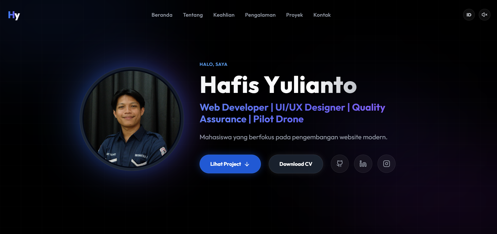

<div align="center">

  # ✨ Premium High-End React Portfolio
  ### 🚀 Hafis Yulianto — Web Developer | UI/UX Designer | QA | Professional Drone Pilot

  <p align="center">
    
  </p>

  <p align="center">
    <a href="https://portfolio-hafisyulianto.vercel.app/">
      
    </a>
    
    
    
    
  </p>

  <p align="center">
    <b>Website portofolio interaktif tingkat tinggi dengan desain glassmorphism modern, animasi smooth, modal detail proyek, pemutar musik latar, dan sistem dwibahasa (ID/EN) real-time.</b>
  </p>

  <a href="https://portfolio-hafisyulianto.vercel.app/">🌐 Jelajahi Live Demo</a> •
  <a href="#-fitur-unggulan">🌟 Fitur Utama</a> •
  <a href="#-teknologi-yang-digunakan">🛠️ Tech Stack</a> •
  <a href="#-panduan-instalasi-lokal">🚀 Cara Menjalankan</a>
</div>

---

## 📖 Ringkasan Project

**Portfolio Hafis Yulianto** adalah aplikasi web modern berpencahayaan neon *ambient glow* yang dirancang untuk memberikan **High-End User Experience (UX)**. Built from scratch menggunakan teknologi web terdepan (React 19, Vite, Tailwind CSS, dan Framer Motion), repositori ini mengintegrasikan arsitektur *data-driven* di mana seluruh isi data teks dipisahkan dari logika visual untuk mempermudah kustomisasi.

---

## 🌟 Fitur-Fitur Unggulan

### 🌐 1. Real-Time Bilingual System (ID / EN)
Ditenagai oleh **React Context API** (`LanguageContext`), pengguna dapat mengganti bahasa antarmuka antara **Bahasa Indonesia** dan **Bahasa Inggris** secara *real-time* tanpa perlu memuat ulang halaman (*zero refresh delay*). Pilihan bahasa pengguna tersimpan secara otomatis di `localStorage`.

### 🪟 2. Interactive Project Detail Pop-up Modal
Setiap kartu proyek dihiasi dengan animasi kartu **3D Tilt** dan efek **Spotlight Hover**. Diklik pada kartu akan membuka **Pop-up Modal interaktif** yang menampilkan:
- Pratinjau gambar proyek resolusi tinggi.
- Penjelasan teknis & rincian proyek secara komprehensif (`text-justify`).
- Label teknologi / *tech stack tags*.
- Akses langsung ke **Live Demo** & **Source Code (GitHub)**.

### 🎬 3. Premium Animations & Smooth Visuals
- **Scroll Progress Bar**: Indicator garis warna gradasi di paling atas layar yang bergerak mengikuti scroll halaman.
- **Glowing Ambient Background**: Bola-bola cahaya (*ambient glowing orbs*) yang bergerak dinamis melayang di latar belakang.
- **Glowing Splash Preloader**: Layar pemuatan awal (*splash screen*) dengan efek pulsa neon untuk memberikan kesan pertama yang eksklusif.

### 🎵 4. Background Audio Player
Pemutar musik latar belakang opsional yang dapat diaktifkan atau dimatikan kapan saja langsung dari tombol kontrol Navbar.

### 📱 5. Responsive Floating Mobile Navbar
Navbar *glassmorphism* melayang yang menyesuaikan ukuran layar secara mulus, dilengkapi dengan *mobile dropdown menu* interaktif yang responsif dan fleksibel.

---

## 🛠️ Teknologi yang Digunakan

| Kategori | Teknologi | Deskripsi |
| :--- | :--- | :--- |
| **Frontend Core** |  | UI Library deklaratif berbasis komponen modular |
| **Build System** |  | Server pengembangan HMR super cepat & bundler produksi |
| **Styling Engine** |  | Utility-first CSS framework untuk glassmorphism & layouting |
| **Motion & Gestures** |  | Library animasi deklaratif untuk gesture, tilt, & modal popup |
| **Iconography** |  | Koleksi ikon SVG modern & bersih |
| **State Management** | React Context API | Manajemen state global dwibahasa & persistent storage |

---

## 📂 Struktur Project

```text
_portfolio_hafisyulianto/
├── public/                 # Asset publik (favicon, preview.png, dll)
├── src/
│   ├── assets/             # Asset statis (gambar profil, logo proyek, bg-music.mp3)
│   ├── components/         # Komponen UI Reusable
│   │   ├── BackToTop.jsx   # Tombol floating kembali ke paling atas
│   │   ├── Navbar.jsx      # Navigation bar, audio control, & dropdown mobile
│   │   ├── Preloader.jsx   # Splash screen loading awal (pulse animation)
│   │   └── ProjectCard.jsx # Kartu proyek 3D Tilt & Pop-up Modal Detail
│   ├── context/            # Management State Global
│   │   └── LanguageContext.jsx # Context API untuk Bahasa ID & EN
│   ├── data/               # Data-Driven Content Source
│   │   └── index.js        # File data terpusat (Profil, Skill, Project, Sertifikasi)
│   ├── sections/           # Section Utama Portofolio
│   │   ├── Hero.jsx        # Landing intro & cinematic text reveal
│   │   ├── About.jsx       # Sekilas profil, latar belakang, & kartu bidang
│   │   ├── Skills.jsx      # Keahlian teknis per kategori
│   │   ├── Experience.jsx  # Timeline perjalanan karir & organisasi
│   │   ├── Achievements.jsx# Prestasi (TeknoCom 2026, KRTI) & Sertifikasi
│   │   ├── Projects.jsx    # Galeri showcase karya proyek
│   │   └── Contact.jsx     # Form kontak langsung ke Gmail & media sosial
│   ├── styles/             # Stylesheet pendukung
│   ├── App.jsx             # Root layout & ambient backdrop
│   ├── index.css           # Konfigurasi Tailwind & Global CSS
│   └── main.jsx            # Entry point React
├── eslint.config.js        # Konfigurasi Linter ESLint 9
├── tailwind.config.js      # Konfigurasi Tema & Utilities Tailwind
├── vite.config.js          # Konfigurasi Vite
└── package.json            # Manifest dependensi & scripts
```

---

## 🚀 Panduan Instalasi Lokal (Local Setup)

Untuk mencoba dan menjalankan project ini di lingkungan lokal Anda:

### 1. Prasyarat
- [Node.js](https://nodejs.org/) (Versi 18+ disarankan)
- [npm](https://www.npmjs.com/) atau [yarn](https://yarnpkg.com/)

### 2. Kloning Repositori
```bash
git clone https://github.com/HafisYulianto/portfolio-hafis.git
cd portfolio-hafis
```

### 3. Instalasi Dependensi
```bash
npm install
```

### 4. Jalankan Development Server
```bash
npm run dev
```
Buka peramban browser Anda di: `http://localhost:5173/`

### 5. Build Produksi & Linter
```bash
# Untuk menguji linting kode:
npm run lint

# Untuk mengompilasi ke bundle siap rilis:
npm run build
```

---

## 📝 Cara Mengubah Konten (Data Customization)

Seluruh isi materi teks, informasi pribadi, keahlian, pengalaman, sertifikasi, serta portofolio proyek dipisahkan secara rapi pada file:

👉 `src/data/index.js`

Contoh struktur data dwibahasa:
```javascript
export const projects = {
  id: [
    {
      id: 2,
      title: "AeroSuoh V2",
      desc: "Pengembangan generasi baru platform pariwisata pintar yang full dinamis.",
      fullDesc: "Deskripsi rinci yang akan tampil pada Pop-up Modal...",
      image: aeroSuohImg, 
      tags: ["Web Dev", "Full Dynamic", "Admin CMS"],
      demo: "https://aerosuoh.vercel.app/"
    }
  ],
  en: [
    {
      id: 2,
      title: "AeroSuoh V2",
      desc: "The next-generation upgrade of the smart tourism platform, fully dynamic.",
      fullDesc: "Detailed description shown in the interactive pop-up modal...",
      image: aeroSuohImg, 
      tags: ["Web Dev", "Full Dynamic", "Admin CMS"],
      demo: "https://aerosuoh.vercel.app/"
    }
  ]
};
```

---

## 👨‍💻 Tentang Pengembang

<table align="center">
  <tr>
    <td align="center">
      <br />
      <b>Hafis Yulianto</b><br />
      <sub>Web Developer | UI/UX Designer | QA | Pilot Drone</sub>
    </td>
  </tr>
</table>

* 🌐 **Website Portfolio:** [portfolio-hafisyulianto.vercel.app](https://portfolio-hafisyulianto.vercel.app/)
* 🐙 **GitHub:** [@hafisyulianto](https://github.com/hafisyulianto)
* 💼 **LinkedIn:** [Hafis Yulianto](https://linkedin.com/in/hafisyulianto)
* 📸 **Instagram:** [@hafisyulianto_](https://instagram.com/hafisyulianto_)

---

<div align="center">
  <p>Dibuat dengan ❤️ oleh <b>Hafis Yulianto</b> © 2026. Hak Cipta Dilindungi.</p>
</div>